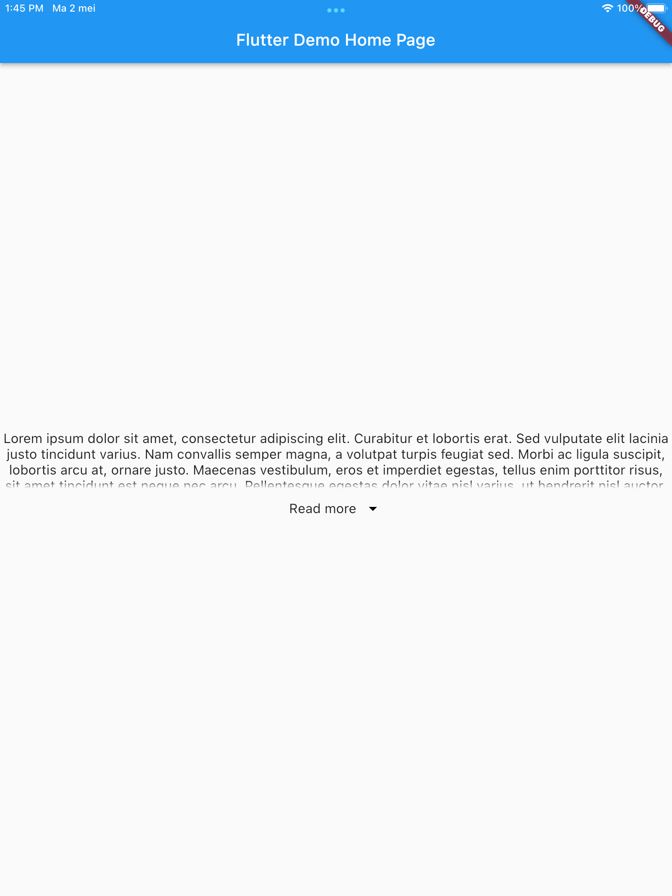
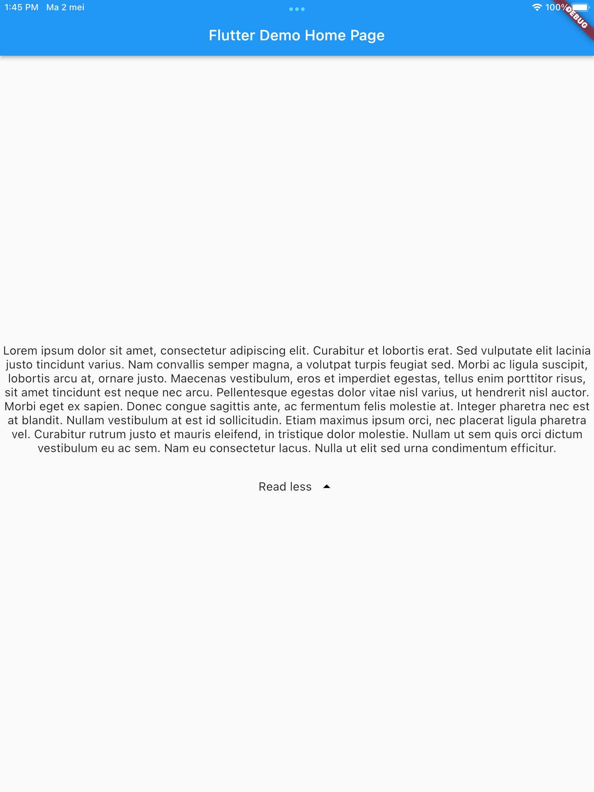

# read_more_less

Provides a widget that shows a read more/less button in case the text exceeds the `maxHeight` provided in the widget.

## Getting Started

### Basic usage

The basic usage is simple. You provide a text and the widget will decide based on the maxHeight if it should show a read more/less button or not.
It is possible to edit the maxHeight (default is 70) as a parameter of `ReadMoreLess`.

```dart
ReadMoreLess(
    text: '''
        Lorem ipsum dolor sit amet, consectetur adipiscing elit. Curabitur et lobortis erat. Sed vulputate elit lacinia justo tincidunt varius. Nam convallis semper magna, a volutpat turpis feugiat sed. Morbi ac ligula suscipit, lobortis arcu at, ornare justo. Maecenas vestibulum, eros et imperdiet egestas, tellus enim porttitor risus, sit amet tincidunt est neque nec arcu. Pellentesque egestas dolor vitae nisl varius, ut hendrerit nisl auctor. Morbi eget ex sapien. Donec congue sagittis ante, ac fermentum felis molestie at. Integer pharetra nec est at blandit. Nullam vestibulum at est id sollicitudin. Etiam maximus ipsum orci, nec placerat ligula pharetra vel. Curabitur rutrum justo et mauris eleifend, in tristique dolor molestie. Nullam ut sem quis orci dictum vestibulum eu ac sem. Nam eu consectetur lacus. Nulla ut elit sed urna condimentum efficitur.
        ''',
),
```

## Screenshots

Collapsed state


Expanded state


## Parameters

| Parameter         | Type       | Description                                                                                                             |
| ----------------- | ---------- | ----------------------------------------------------------------------------------------------------------------------- |
| text              | String     | The main text to be displayed.                                                                                          |
| readLessText      | String?    | The text on the button when the text is expanded, in case the text overflows                                            |
| readMoreText      | String?    | The text on the button when the text is collapsed, in case the text overflows                                           |
| animationDuration | Duration   | The duration of the animation when transitioning between read more and read less.                                       |
| maxHeight         | double     | The maximum height of container around the [text] in the collapsed state.                                               |
| textStyle         | TextStyle? | The main textstyle used for [text]                                                                                      |
| textAlign         | TextAlign  | Whether and how to align [text] horizontally.                                                                           |
| iconCollapsed     | Widget     | Allows a widget to replace the icon in the read more/less button in the collapsed state.                                |
| iconExpanded      | Widget     | Allows a widget to replace the icon in the read more/less button in the expanded state.                                 |
| iconColor         | Color      | The color of the icon in the read more/less button. Does not work when [iconCollapsed] or [iconExpanded] are specified. |
